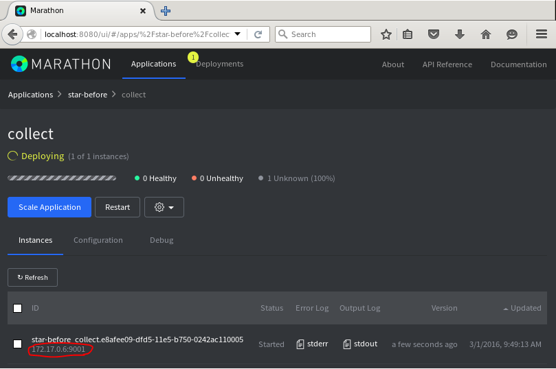
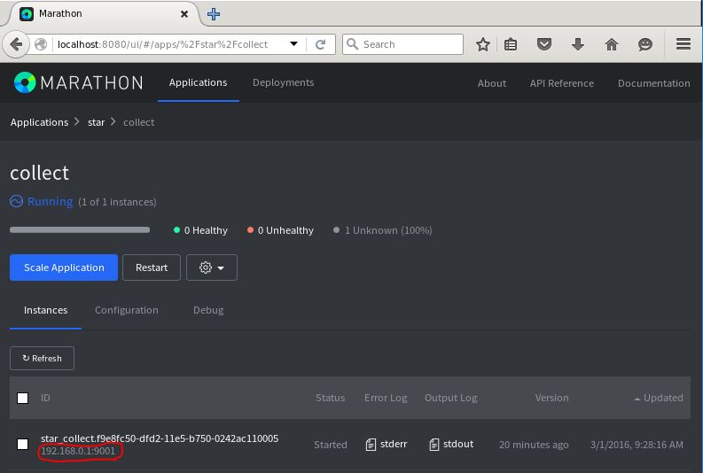

# Network isolation modules for [Apache Mesos](http://mesos.apache.org)
This repository showcases [Project Calico][project-calico] as the reference implementation for pluggable Mesos networking.


## Versioning
The following table provides information on which Netmodules branches/releases are compatible with which version of Mesos:

| Mesos Version | Netmodules Version |
|---------------|--------------------|
| 0.27.0        | 0.2.x              |
| 0.26.0        | 0.1.x              |

## Demo
We recommend running the demo from a Linux host, specifically Ubuntu 14.04-desktop. A Vagrant file has been provided to create this environment.

### Vagrant Setup

1. Download and install VirtualBox and Vagrant.

2. Clone this repository.

        git clone https://github.com/mesosphere/net-modules.git

3. Start the Vagrant VM.  This will automatically provision the VM.  Sit back and relax, it takes a few minutes to pre-load the Docker images used for the demo.

        cd net-modules
        vagrant up

4. Ensure you wait until the Vagrant script has completed succesfully before [moving onto the Demo](#demo-1).

_Note: the shell provision step contains steps that must be performed each time the VM is booted.  Append the `--provision-with shell` flag when running `vagrant up` or `vagrant reload` when booting the VM subsequent times._

### Linux Setup

1. Install Docker: https://docs.docker.com/installation/

2. Install Docker-compose:  https://docs.docker.com/compose/install/

3. Load Kernel modules used by Project Calico:

        sudo modprobe ip6_tables
        sudo modprobe xt_set

4. Clone this repository.

        git clone https://github.com/mesosphere/net-modules.git

## Demo
Vagrant users should run all demo functionality from within their Ubuntu VM.

### Build the demo (Vagrant and Linux)
To visualize Network connectivity across a mesos cluster, we will first use docker-compose to launch all the necessary components. Then, we will use Marathon to launch several instances of [Star](https://github.com/mesosphere/star), mesosphere's network connectivity visualizer. 

The demo uses docker-compose to launch several docker images which simulate a full Mesos Cluster:

| Image       | Description          |
|-------------|----------------------|
| mesosmaster | mesos master         |
| slave       | mesos slave          |
| marathon    | mesos app framework  |
| zookeeper   | datastore for Mesos  |
| etcd        | datastore for Calico |

To download and build these docker images, enter the `net-modules` directory and run:

    make images

>Note: Docker-compose may take up to 15 minutes to download and build each of the above images.

### Run the "Before" Demo
This first demo shows what life is like with "vanilla" Mesos: **port conflicts and no network isolation.** 

1. Launch the Cluster

        ./demo/launch-cluster.sh

   >The docker-compose.yml file binds port 5050 on the Host to port 5050 of the Mesos-Master docker container, allowing quick access to the mesos UI via http://localhost:5050/. Upon visiting the UI, you should see a working Mesos status page with no tasks and two slaves.

2. Launch the probes:

        ./demo/launch-probes-before.sh

   

3. Now we'll view the Stars Visualization. The visualizer UI itself is a Marathon task which uses port 9001. It will be accessible via port 9001 on whichever slave marathon has placed it on. An easy way to view it is to follow the task link in Marathon's UI. 

   From your demo host, visit the following URL: [http://localhost:8080/#apps/%2Fstar-before%2Fcollect](http://localhost:8080/#apps/%2Fstar-before%2Fcollect). Click the link to its IP address to view the UI:

    

    Since all four tasks require port 9000, and since there is only two slaves, only two tasks will succesfully launch. Additionally, we will see that both tasks can communicate with one another, since no networking isolation is provided. 
    
    Next, we'll see how Netmodules, Mesos, and Calico can allow all four apps to launch on two agents by giving each task their own IP address.

4. Tear down the probes before continuing:

        ./demo/stop-probes-before.sh

### Run the After Demo - with Netmodules and Calico
Now we'll see how Mesos can use Netmodules networking hooks and Calico networking to provide tasks with their own IP. For this stage of the demo, all probes will able to communicate with each other via their Calico-IPAM'd IP.

1. Since Mesos Networking is opt-in, we can use the same cluster to launch tasks networked with Calico. Run the following script to launch calico-networked probes:

        ./demo/launch-probes.sh

    The app JSON for each task hass been modified to include the following fields:
    ```
    "ipAddress": {
        "groups": ["public"],
        "discovery": {
          "ports": [
            { "name": "status", "number": 9000, "protocol": "tcp" }
          ]
        }
      }
    ```
    What's going on behind the scenes? By specifiying the `ipAddress` field, Marathon will fill in the `NetworkInfo` for this task. When netmodules is triggered during task creation, it will read the task's NetworkInfo field and trigger Calico to complete networking and IPAM for the task.
    
    What are those discovery ports? Tasks networked with their own IP address don't use ports on their slave. Therefore, they can not request ports. Mesos uses a tasks ports to perform healthchecks and expose service information to other frameworks. By specifiying discovery ports in our `ipAddress` field, it is possible to describe the ports that the Application's task exposes, and inform mesos that even though it has not used the ports resource, it has an active application running on specific ports.
    
    Still confused? See [Marathon's 0.14.0 release notes](https://github.com/mesosphere/marathon/releases/tag/v0.14.0)  for more information.

2. Since each probe has its own IP, we can view the Stars Visualizer by directly navigating to the IP it was statically assigned. Just as we did in the before-demo, find the collector task's IP using marathon's UI: [http://localhost:8080/#apps/%2Fstar%2Fcollect](http://localhost:8080/#apps/%2Fstar%2Fcollect). You'll notice that the IP address listed in Marathon's UI is the calico-assigned 192.168.0.0/16 address:

    

### Run the Calico Demo With Isolation
1. Using the same cluster, launch the test probes and targets with isolation.

        ./demo/launch-probes-isolated.sh

    These probes have slightly different app JSON than the calico tasks from before - they have also specified a netgroup:
        
        "ipAddress": { "groups": ["star-1"] }

    Netmodules leaves it to the network isolator on how to implement the netgroup request. For Calico, apps will be isolated based on this netgroup. Apps will only be able to communicate with other apps that are assigned the same netgroup. Once a netgroup has been created, calico allows for further customization using `calicoctl`, calico's command line tool.
    
    The apps we just launched have been assigned netgroups according to the following table:

    | App     | Netgroup |
    |---------|----------|
    | probe-A |  star-1  |
    | probe-B | star-1   |
    | probe-C | star-2   |
    | probe-D | star-2   |
    
    Verify that these apps can only communicate with one another if they're in the same netgroup by following the link in the Marathon UI: [http://localhost:8080/#apps/%2Fstar-iso%2Fcollect](http://localhost:8080/#apps/%2Fstar-iso%2Fcollect)

3. That's it! Tear down your running probes:

        ./demo/stop-probes.sh
        ./demo/stop-probes-isolated.sh

   Or, alternatively simply tear down the cluster.

        ./demo/stop-cluster.sh

##Next Steps
For Information on installing Netmodules and Calico, see [calico-mesos-deployments](https://github.com/projectcalico/calico-mesos-deployments)

[project-calico]: https://github.com/projectcalico/calico-containers
